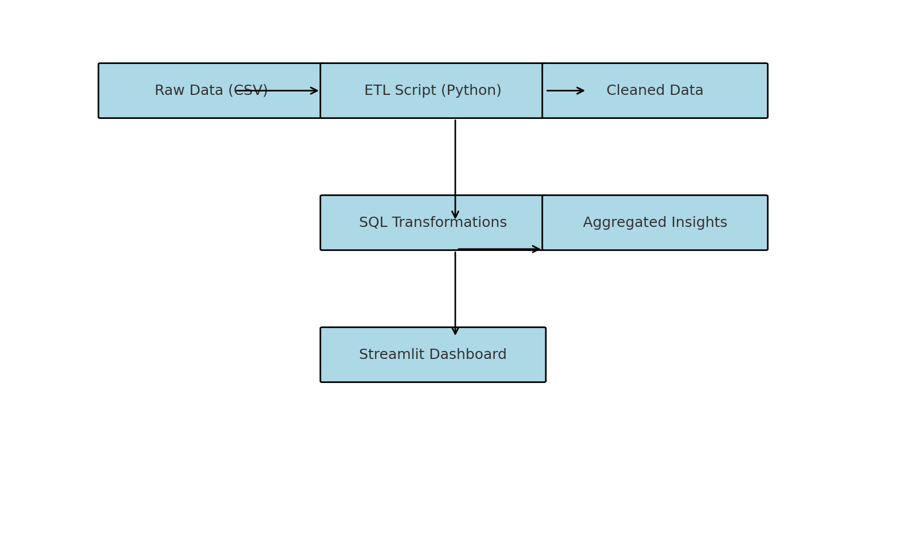

# ShelfFlow: Building a Modern Data Stack for Retail Inventory Optimization

## Overview
ShelfFlow is a fully implemented data engineering pipeline designed to detect and forecast inventory shortages across multiple F&B retail locations. It simulates a real-world use case for any Data Engineer working with operational analytics.

## Key Features
- Python-based ETL to merge, clean, and aggregate sales/inventory data
- SQL for summarizing business KPIs using CTE-style queries
- Streamlit dashboard for stakeholder visibility
- Synthetic dataset with 365 days of data from 5 stores and 100 products

## Folder Structure
- `data/`: Contains raw and processed CSVs
- `src/`: Python ETL pipeline
- `sql/`: SQL transformation scripts
- `dashboard/`: Streamlit dashboard app

## Setup Instructions
1. Clone this repo and install dependencies:
```bash
pip install -r requirements.txt
```

2. Run the ETL pipeline:
```bash
python src/etl_pipeline.py
```

3. Launch the dashboard:
```bash
streamlit run dashboard/app.py
```

## Business Value
ShelfFlow enables data teams to:
- Identify underperforming SKUs by location
- Forecast stockouts based on sales velocity
- Make data-driven restocking decisions

## Visualization


## Author
Raja Usama Abbas – AI Engineer | [LinkedIn](https://www.linkedin.com/in/raja-a-96036a135)
